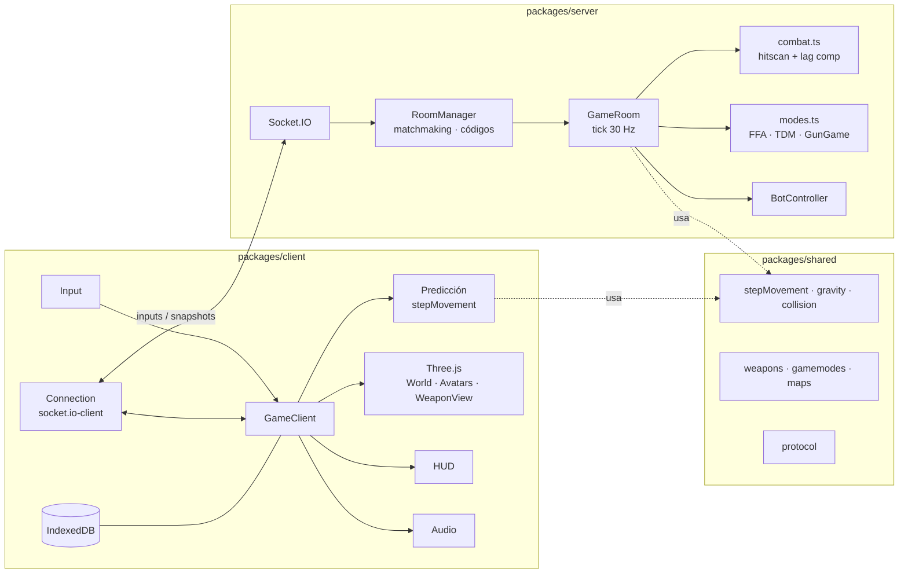

# Arquitectura de Aether Syndicate

## Principios

1. **Servidor autoritativo.** El cliente nunca decide daño, muertes ni posición final: propone inputs, el servidor simula. Es la base anti-cheat.
2. **Simulación compartida.** El movimiento vive en `@aether/shared` y se ejecuta bit a bit igual en cliente (predicción) y servidor (autoridad). Si divergen, la reconciliación corrige.
3. **Data-driven.** Armas, modos y mapas son datos declarativos. Los sistemas los consumen sin conocer casos concretos.
4. **Módulos desacoplados.** El HUD no conoce la red; la red no conoce Three.js; la simulación no conoce nada del navegador. Cada módulo se puede sustituir sin romper el resto.
5. **Protocolo tipado.** `ClientToServer` / `ServerToClient` en shared: un cambio de protocolo rompe la compilación, no la partida.

## Diagrama general

## packages/shared

| Módulo | Responsabilidad |
|---|---|
| `sim/movement.ts` | Paso de simulación determinista: fricción, aceleración estilo quake, salto, vuelo 6-DOF en gravedad cero. |
| `sim/gravity.ts` | Zonas de gravedad (AABB con prioridad). `gravityAt(pos)` es la única fuente de verdad. |
| `sim/collision.ts` | AABB vs brushes (resolución eje a eje) y raycasts (slab method). |
| `data/weapons.ts` | Definiciones de armas. **Añadir arma = añadir entrada.** |
| `data/gamemodes.ts` | Definiciones declarativas de modos. |
| `data/maps/` | Formato de mapa + registro. La malla visual del cliente se genera desde los mismos brushes de colisión. |
| `protocol/messages.ts` | Contrato Socket.IO tipado. |
| `constants.ts` | Tick rates, físicas, salud. Un solo lugar. |

## packages/server

- **`rooms/RoomManager.ts`** — ciclo de vida de salas: matchmaking (busca hueco o crea), salas privadas con contraseña, códigos de 6 caracteres sin ambigüedades, limpieza al vaciarse.
- **`rooms/GameRoom.ts`** — el corazón: bucle fijo a 30 Hz que (1) aplica inputs con la simulación compartida, (2) resuelve combate, (3) regenera escudos y respawnea, (4) consulta al modo de juego, (5) difunde snapshots con ack por jugador.
- **`game/combat.ts`** — hitscan con **compensación de lag**: rebobina a los objetivos a la posición que el tirador veía (delay de interpolación + RTT/2, con tope).
- **`game/modes.ts`** — interfaz `GameModeLogic` (assignTeam / onKill / onTimeUp / loadoutFor). **Añadir modo = implementar la interfaz y registrarla.**
- **`game/BotController.ts`** — bots de relleno: deambulan, detectan línea de visión y disparan con error humano.

## packages/client

- **`core/Input.ts`** — pointer lock, teclado/ratón → estado abstracto.
- **`net/Connection.ts`** — socket tipado; guarda inputs sin confirmar y los reenvía con redundancia.
- **`game/GameClient.ts`** — orquestador de partida: bucle de render, pasos fijos de input a 60 Hz, predicción + reconciliación, dispatch de eventos a HUD/audio/VFX.
- **`game/World.ts`** — construye la escena desde el `MapDef` (lo que ves = contra lo que chocas), zonas de gravedad visualizadas, campo de estrellas.
- **`game/PlayerAvatars.ts`** — interpolación de remotos 100 ms en el pasado.
- **`game/WeaponView.ts`** — viewmodel procedural: bob, retroceso, fogonazo, trazadoras.
- **`ui/hud.ts`** — solo DOM; recibe datos digeridos.
- **`audio/AudioManager.ts`** — sonido procedural WebAudio con atenuación por distancia (sustituible por samples+HRTF).
- **`persistence/storage.ts`** — clave/valor IndexedDB para ajustes y, en el futuro, inventario/offline.

## Cómo extender

| Quiero… | Toco… |
|---|---|
| Añadir un arma | `shared/data/weapons.ts` (una entrada) |
| Añadir un mapa | `shared/data/maps/<mapa>.ts` + registrarlo en `maps/index.ts` |
| Añadir un modo | `shared/data/gamemodes.ts` + clase en `server/game/modes.ts` |
| Añadir un tipo de gravedad | `shared/sim/gravity.ts` (`GRAVITY_SCALES`) |
| Cambiar el netcode | `shared/constants.ts` (tick/interp) o `server/rooms/GameRoom.ts` |
| Añadir un proveedor de login | pantalla en `client` + Supabase Auth (ver roadmap fase 2) |

## Decisiones y deuda técnica asumida (v0.1)

- **Geometría por brushes AABB**: simple, rápida y determinista. Migrar a mallas con colisión BVH cuando haya arte real.
- **Snapshots JSON completos**: legible y suficiente para <16 jugadores. El plan es delta-compression + binario (ver roadmap fase 3) antes de 32-64 jugadores.
- **Bots sin navmesh**: deambulan entre spawns. Suficiente para rellenar; un navmesh llegará con el editor de mapas.
- **Munición por arma se rellena al cambiar de slot**: simplificación marcada con comentario en `PlayerEntity.switchSlot`.
- **Supabase/SQLite offline**: la capa de persistencia (`storage.ts`) ya aísla el acceso a datos; conectar Supabase no toca el juego.
